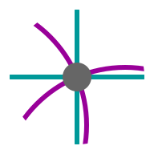

## Coordinates

Coordinatesは,複数の座標系を見比べられます。  
平面における幾つかの曲線座標系の等値曲線を重ねて見ることができます。

[Coordinates を開く](https://akimikimikimikimikimikimika.github.io/Coordinates/Coord.html "Coordinates")  

[ソースコード](https://github.com/akimikimikimikimikimikimika/Coordinates/ "ソースコード")

### 基本

- デカルト座標系,極座標系は勿論,それ以外の座標系も数種類導入。
- 複数の座標系を並べて比較することができる。

### 座標系

メニューから次の座標系を選択することができる

- **xy** … デカルト座標系  
- **rθ** … 極座標系
- **PB** … 放物線座標系 (u,v)  
	x = (u²-v²)/2  
	y = uv  
	-∞ < u < +∞ , v ≥ 0

- **EP** … 楕円座標系 (u,v)  
	x = a∙cosh(u)cos(v)  
	y = a∙sinh(u)sin(v)  
	u ≥ 0 , -π ≤ v ≤ +π
  
- **BP** … 双極座標系 (u,v)  
	x = a∙sinh(v)/(cosh(v)-cos(u))  
	y = a∙sin(u)/(cosh(v)-cos(u))  
	-π ≤ u ≤ +π , -∞ < v < +∞

### 特記事項
- JavaScript,CSSを無効にすると利用できない。
- 同じURLでそのままデスクトップでも,モバイルでも利用できる。
- Internet Explorerでは利用できない。
- iOSデバイスは, iOS 13 以降が必要。
- iPhone X 対応。